# 🎧 IEM Tool

A Very Basic & Simple App For Everything IEMs

Built for IEM enthusiasts who want an all-in-one offline tool for reviewing, tuning, testing, comparing, and exploring in-ear monitors.

---

## ✨ Features

📝 Rate & Review IEMs  
🎚️ 10-Band EQ  
🪄 AutoEQ  
🔍 Find Similar IEMs  
🏷️ Auto-Tagging  
🔊 3D Surround Simulator  
🎮 Blind A/B Test  
👂 Hearing Test  
🔥 IEM Burn-In Timer  
📸 Export Score Cards  
📂 Drag & Drop Files  
🎨 Custom Skins & Fonts  
📊 Music Visualizers  
📤 Export Presets  
💾 Save & Compare  
🚫 100% Offline  

---

# 📸 App Preview

## 📝 Review Dashboard

The main review workspace for analyzing IEMs, ratings, notes, and sound characteristics.

  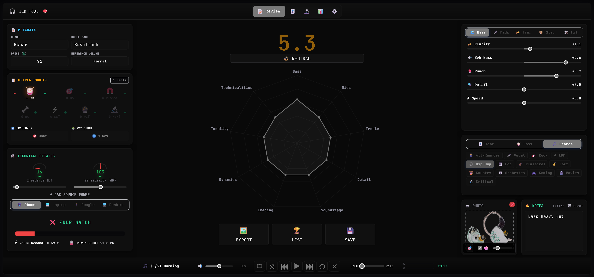

---

# 🎚️ EQ Engine

Advanced equalizer tools including tuning, presets, frequency adjustments, and audio customization.

  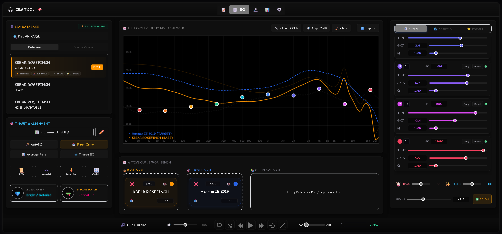

---

# 🧪 Audio Test Lab

Frequency testing, audio tools, blind comparisons, and diagnostics for evaluating IEM performance.

  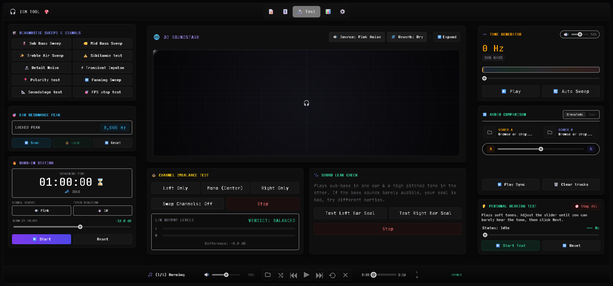

---

# 🌌 Audio Visualizer

Real-time music visualizers and immersive audio effects.

  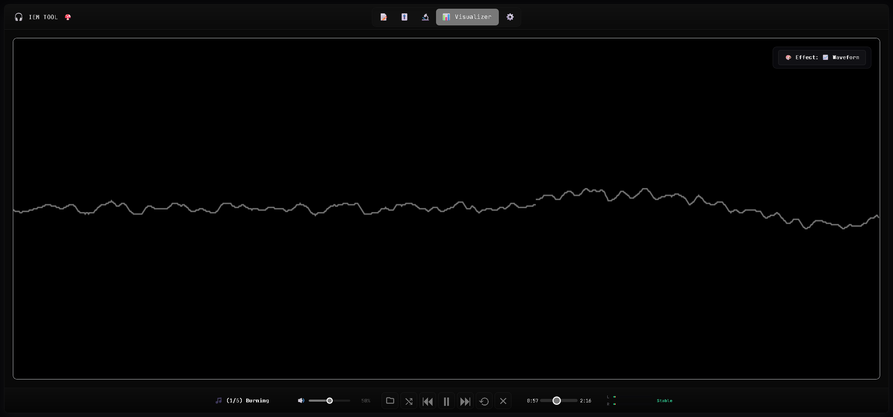

---

# ⚙️ Settings

Application controls, customization options, themes, and preferences.

  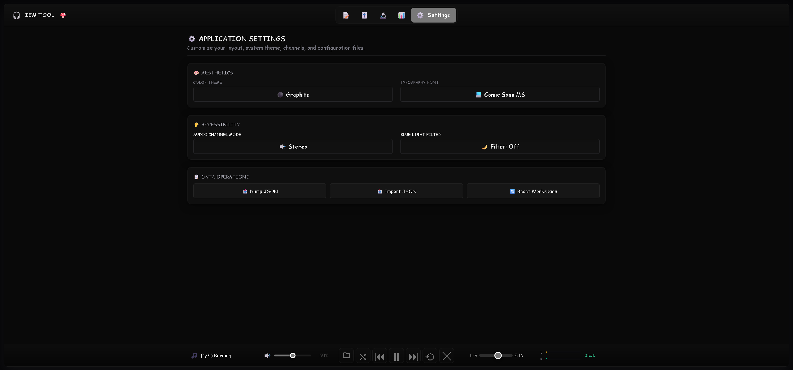

---

# 🎨 Review Card Themes

Customize your IEM review cards with different visual styles.

## 🌑 Void

  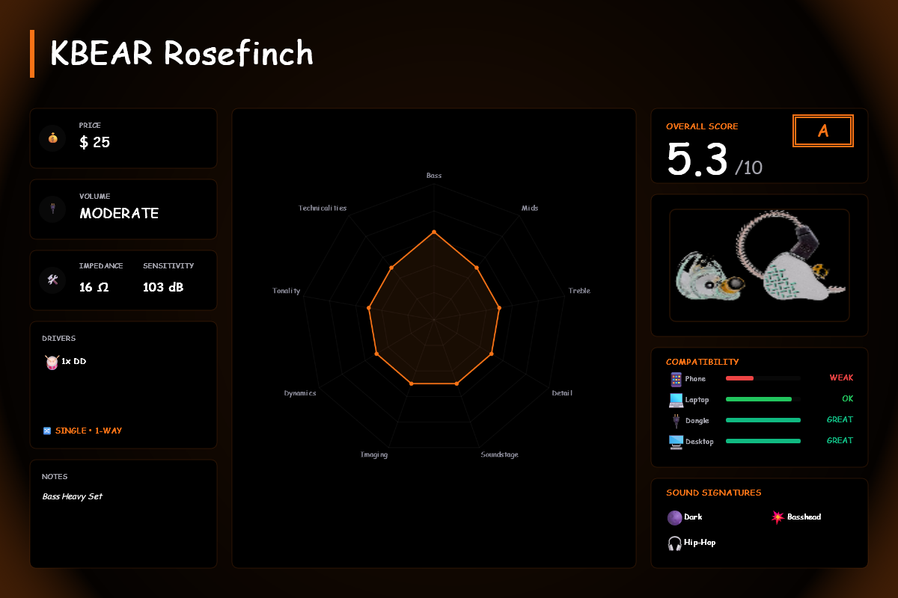

## 🖤 Graphite

  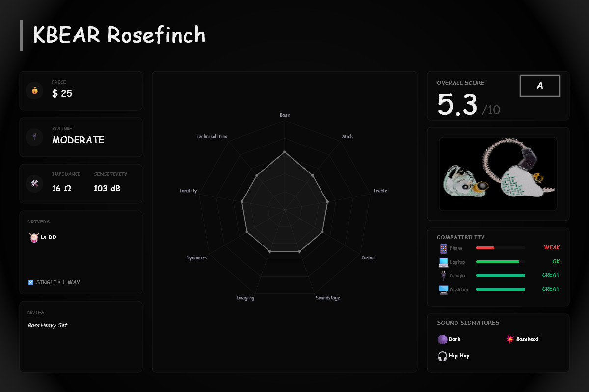

## 🌙 Midnight

  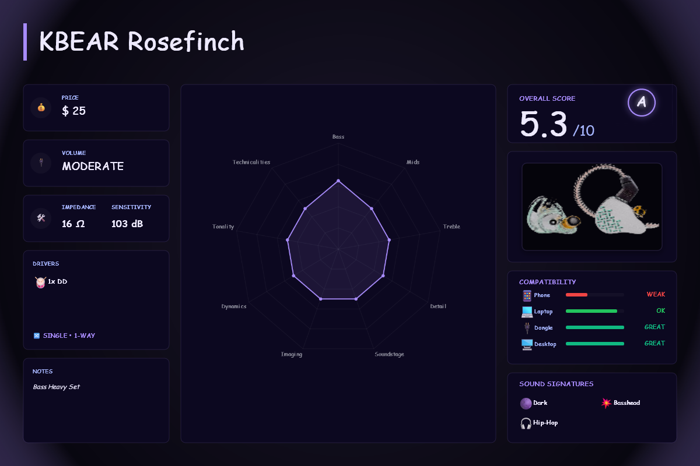

## 🌊 Ocean

  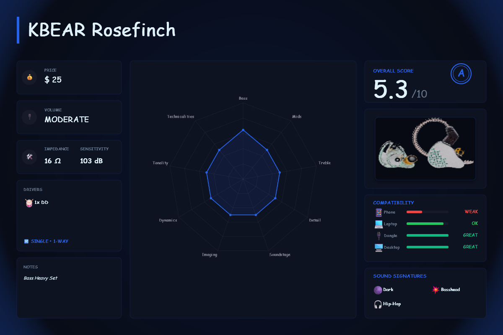

## 🔥 Crimson

  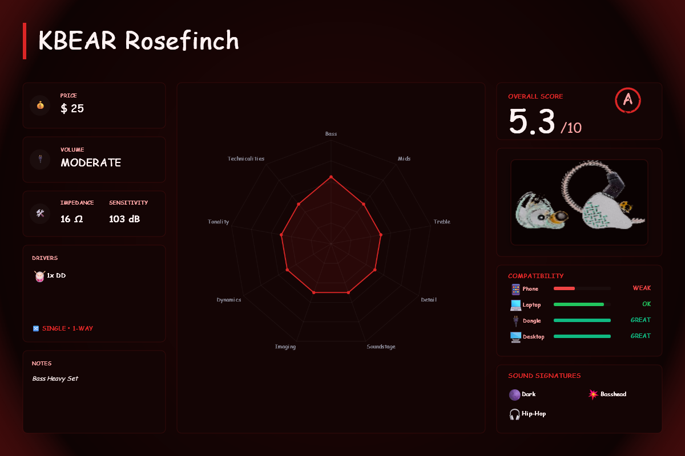

## 🌸 Sakura

  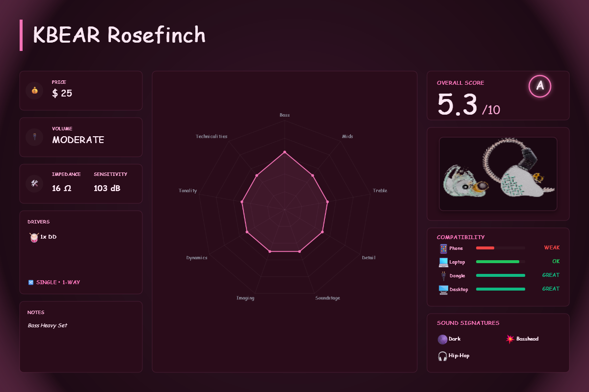

## 🌅 Sunset

  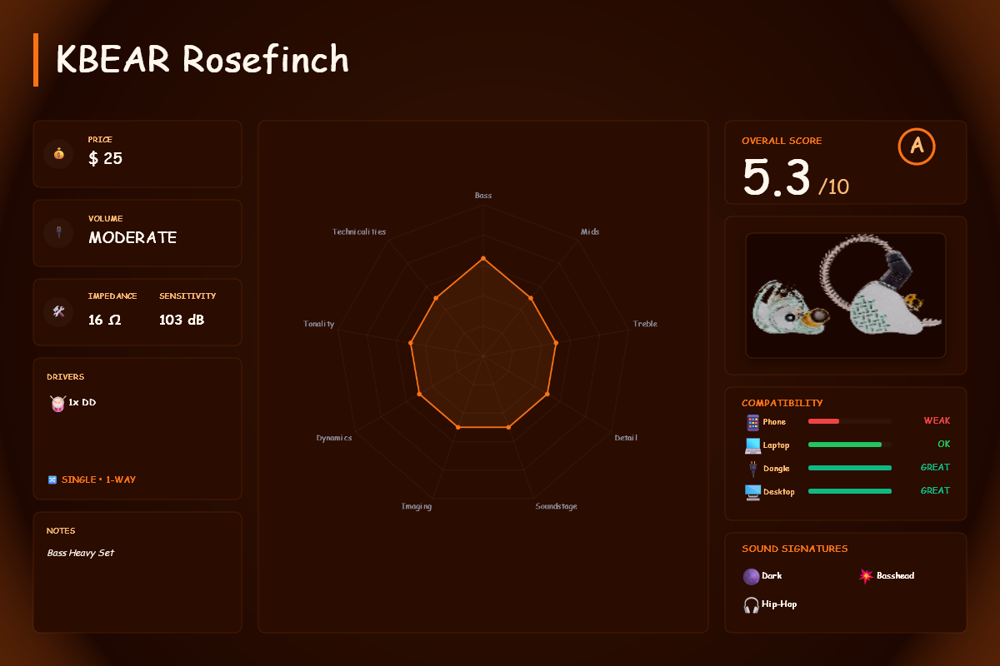

## 🎹 Synthwave

  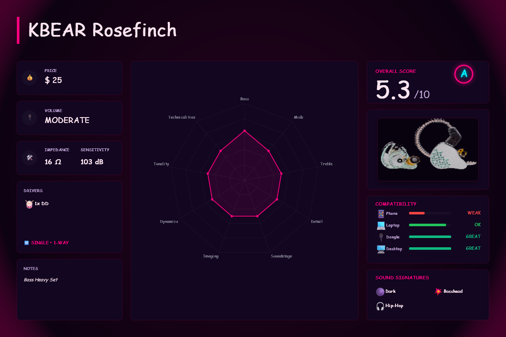

## ☢️ Pip-Boy

  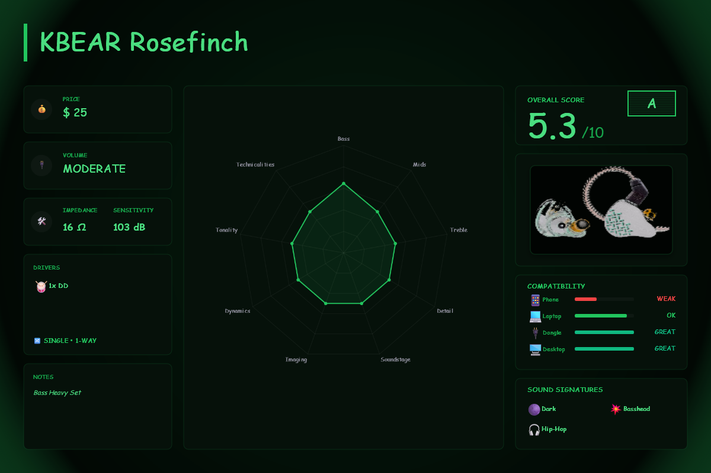

---

# 📂 IEM Manifest Generator (`IEM Manifest Generator.exe`)

### ❓ What does this tool do?
The **IEM Tool** app relies on a `manifest.json` file to know exactly which IEM measurement curves are available in your library. When new curve files are added, removed, or renamed inside the `data` folder, this manifest needs to be regenerated.

This utility automatically scans your IEM database and rebuilds the `manifest.json` file so the app can detect your updated collection.

### 🌟 Key Features:
* **🔍 Automatic Folder Scan:** Recursively scans the `data` folder and finds all available `.txt` measurement curve files.
* **🗺️ Manifest Generation:** Creates and overwrites `manifest.json` with the updated IEM curve list.
* **📚 Database Expansion:** Easily add new IEM measurement files without manually editing database files.
* **⚡ Portable:** Runs as a standalone executable with no Python installation required.

### 🚀 How to use it:
1. Place **`IEM Manifest Generator.exe`** in the same folder as your `data` folder.
2. Add, remove, rename, or update your IEM `.txt` curve files inside the `data` folder.
3. Double-click **`IEM Manifest Generator.exe`**.
4. The tool will scan your database and overwrite `manifest.json` automatically.
5. Launch the **IEM Tool** app and your updated IEM library will be available.

---

# 🎛️ IEM Curve Converter (`IEM Curve Converter.exe`)

### ❓ What does this tool do?
Measurement data from sources like Squiglink, Crinacle, and other IEM databases can come in different formats, naming styles, and layouts.

This utility converts raw measurement files into a standardized format that works directly with the **IEM Tool** application.

### 🌟 Key Features:
* **📁 Universal Reader:** Supports common raw measurement formats including `.txt` and `.csv` files.
* **⚖️ Left & Right Averaging:** Automatically combines Left and Right measurement files (such as `[1]` and `[2]` variants) into a single averaged frequency response curve.
* **✍️ Clean File Naming:** Standardizes file names and converts them into an organized format.
* **📂 Automated Organization:** Places converted files into a dedicated `Converted` folder for easy importing.

### 🚀 How to use it:
1. Place **`IEM Curve Converter.exe`** inside the folder containing your raw `.txt` or `.csv` measurement files.
2. Double-click the executable.
3. The converter will process the files automatically.
4. Open the generated **`Converted`** folder to find your cleaned and standardized IEM curve files.
5. Move the converted files into your IEM Tool `data` folder and run **`IEM Manifest Generator.exe`** to update your library.