# 🎧 IEM Tool

A fast, 100% offline desktop workspace for exploring, tuning, testing, and reviewing In-Ear Monitors (IEMs). 

No servers, no tracking, and no internet connection required.

---

## ⚡ Key Workspaces

### 1. 🔍 Find (Recommendations & Clones)
* **Tuning Search:** Move bass, warmth, vocal, and treble sliders to find matching IEMs from the database.
* **Spec Filters:** Filter by price ($0 to $3000), release year, driver configuration (DD, BA, Planar, EST, PZT, BC, MEMS), connectors, and tags.
* **Taste Matcher:** Average up to 3 of your favorite IEMs to generate a combined target curve and find similar sets.
* **Gems:** Pick a $500+ flagship IEM to find budget alternatives ($15 to $200) with matching frequency response curves.
* **Upgrade Pathway:** Select an IEM you own to generate a 3-tier upgrade ladder (*Starter*, *Leap*, *Endgame*).

<p align="center">
  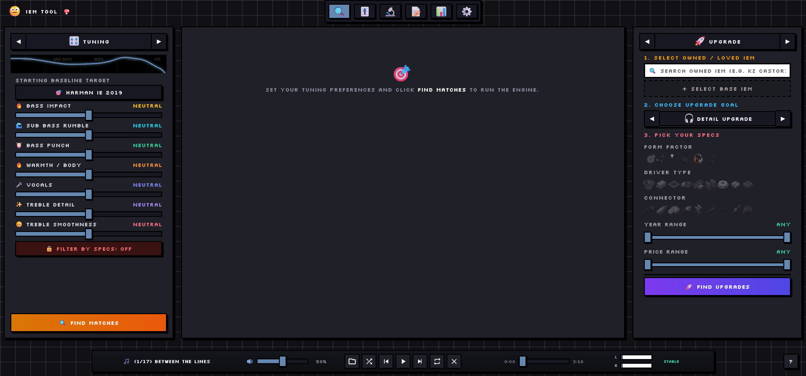
</p>

---

### 2. 🎚️ EQ (Parametric Equalizer)
* **Interactive FR Graph:** Drag EQ nodes or freehand draw custom target curves directly onto the graph.
* **Database & Similar Finder:** Browse the measurement database or flip to Similar to surface IEMs matching the current graph.
* **AutoEQ Engine:** One-click solver supporting 10 to 50 filter bands with anti-clip limiting and auto-gain compensation.
* **Genre Target Overlay:** Real-time matching against music and game genre profiles. Use the stepper to cycle genres and AutoEQ directly to that profile.
* **Audio Tools:** Crossfeed, stereo expander, loudness compensation, de-esser, and reverb simulator.
* **Export Presets:** One-click export to **Peace**, **Wavelet**, **Poweramp**, **Qudelix**, and **FxSound**.

<p align="center">
  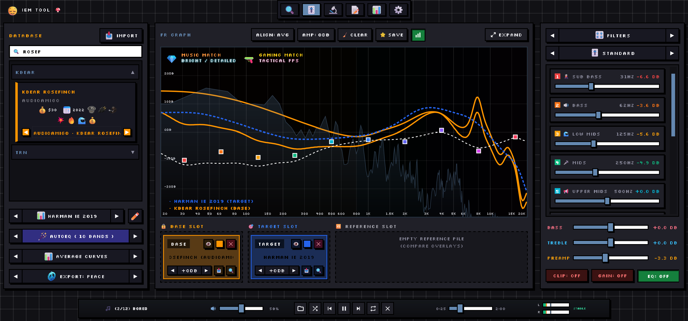
</p>

---

### 3. 🔬 Test (Acoustic Lab)
* **Resonance Peak Sweeper:** Sweep 6.4 kHz–9.6 kHz to locate your personal ear canal resonance peak and generate an automatic notch filter.
* **Channel Imbalance & Swap:** Real-time L/R RMS meters and single-click channel swapping.
* **ABX & Blind A/B Testing:** Compare audio tracks side-by-side with crossfading and statistical confidence scoring.
* **Soundstage & Burn-In:** 3D HRTF positioning pad, hearing threshold test, and timed white/pink/brown noise generator with rest cycles.

<p align="center">
  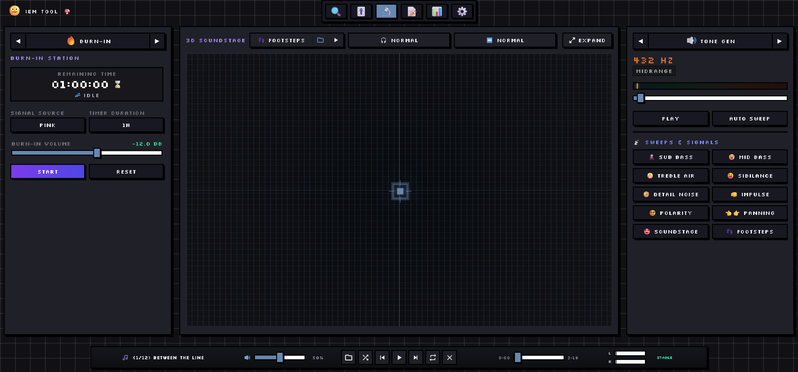
</p>

---

### 4. 📝 Review (IEM Evaluation Suite)
* **Spec Configurator:** Set driver counts, crossover topologies, and acoustic types.
* **Power & DAC Calculator:** Calculate required voltage (Vrms), power (mW), and damping factor compatibility across phones, dongles, and desktop amps.
* **Radar Spider Chart:** 9-axis breakdown across bass, mids, treble, soundstage, imaging, and technicalities.
* **Profile Library:** Attach photos (with automatic background removal), save notes, and compare up to 4 IEM reviews side-by-side.

<p align="center">
  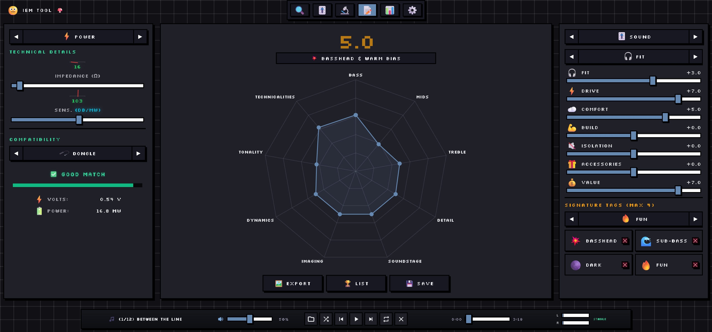
</p>

---

### 5. 📊 Visualizers & 🎨 Themes
* **6 Audio Visualizers:** Neon Stars, Liquid Fiber Wave, Cosmic Vortex, Spectrum Bars, EQ Grid, and Aurora Ribbons.
* **9 Retro Skins:** Slate *(Default)*, Parchment, Ember, Circuit, Byte, Cartridge, Arcade, Blush, and Bit with matching pixel fonts.

| Theme | Preview |
| :--- | :---: |
| **Slate** *(Default)* | 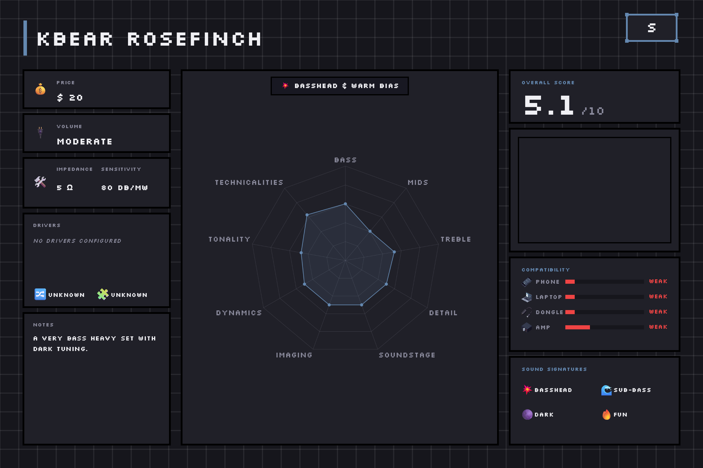 |
| **Parchment** | 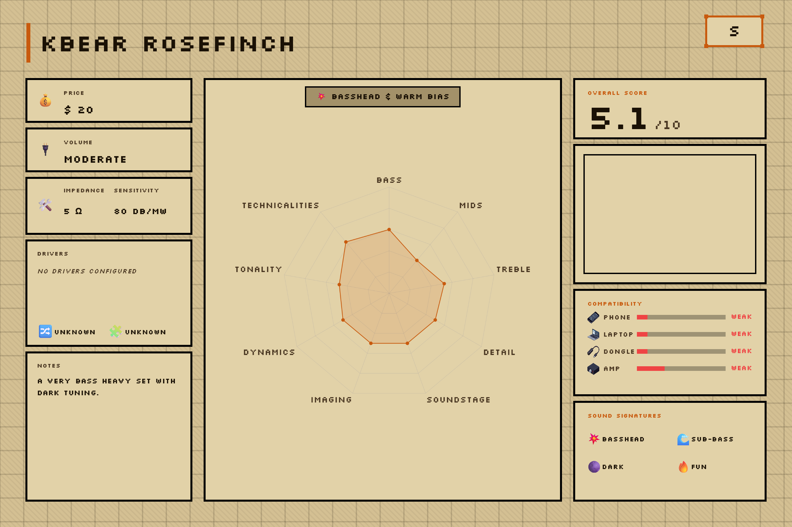 |
| **Ember** | 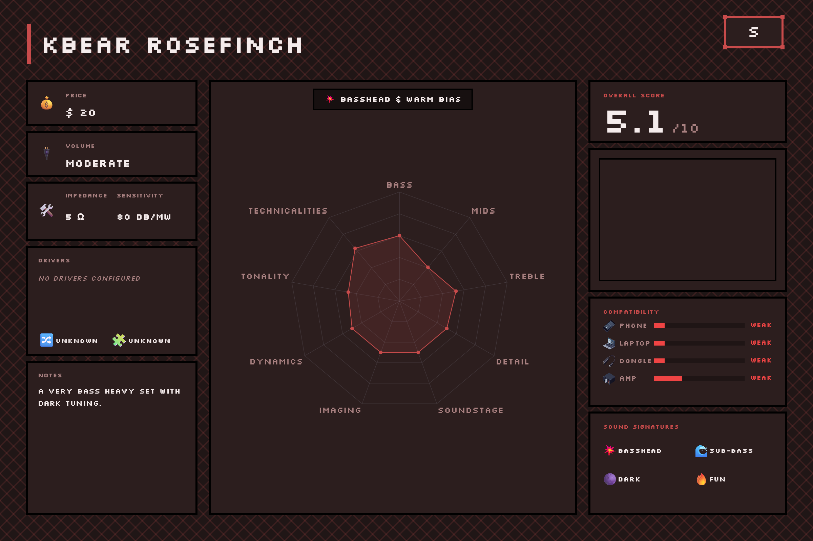 |
| **Circuit** | 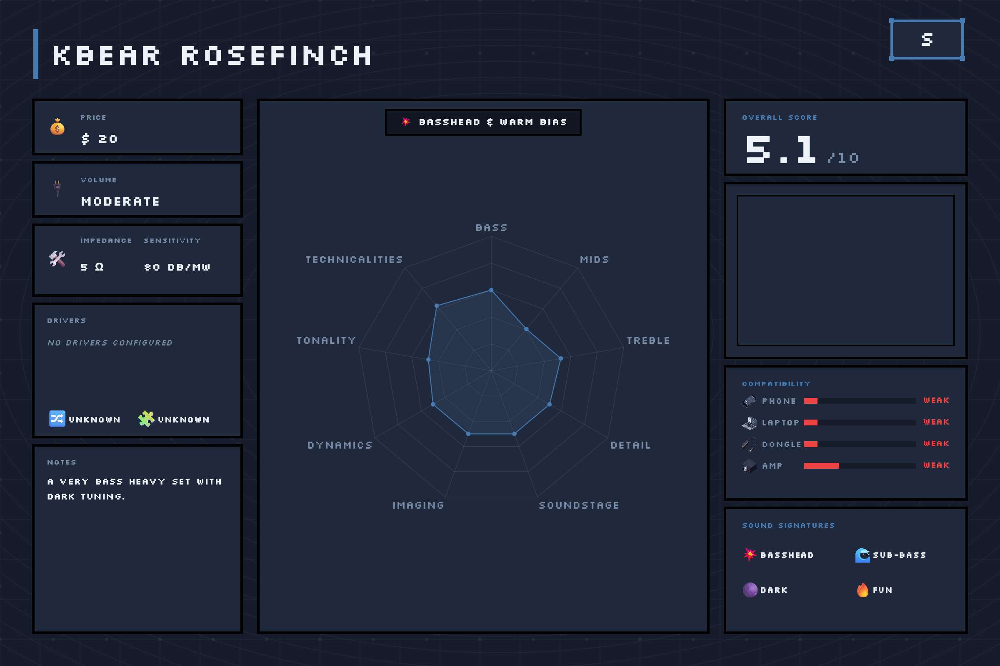 |
| **Byte** | 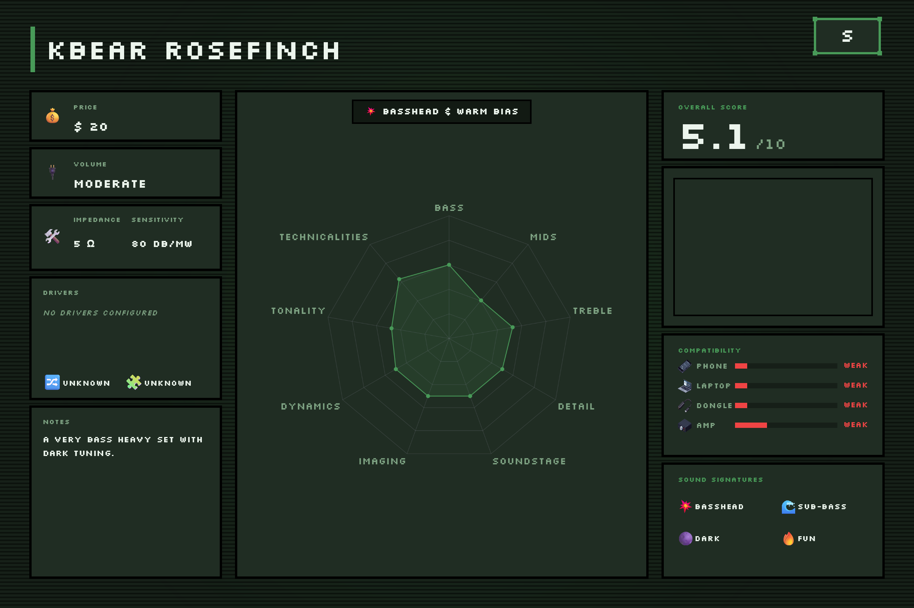 |
| **Cartridge** | 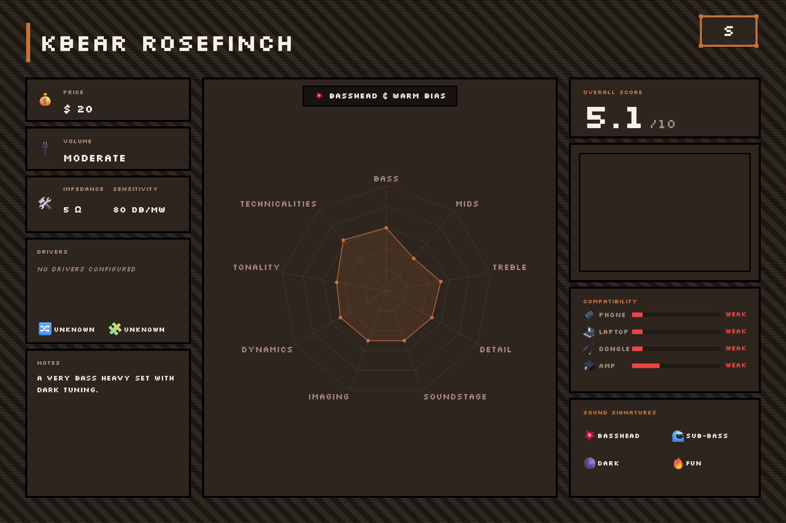 |
| **Arcade** | 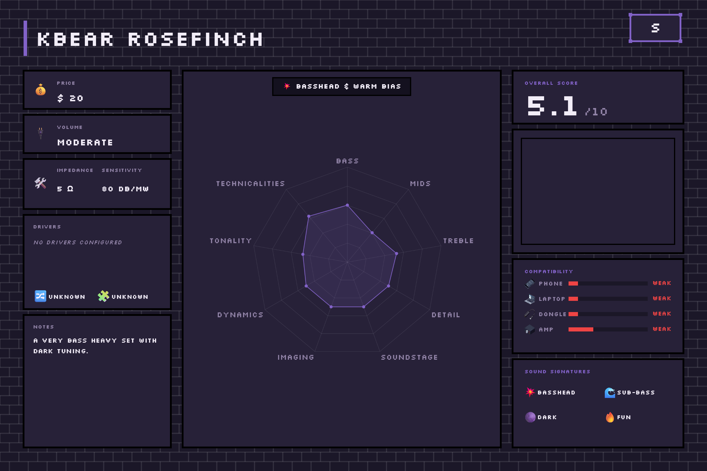 |
| **Blush** | 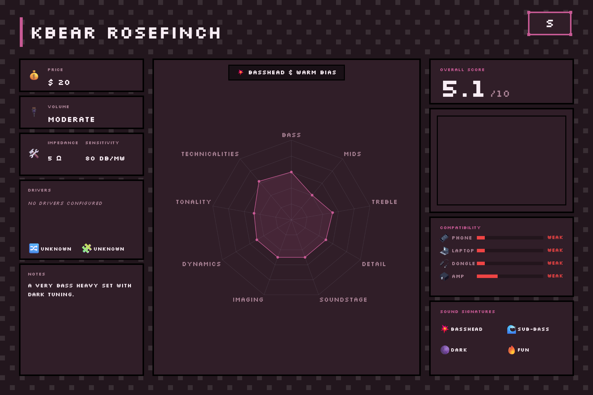 |
| **Bit** | 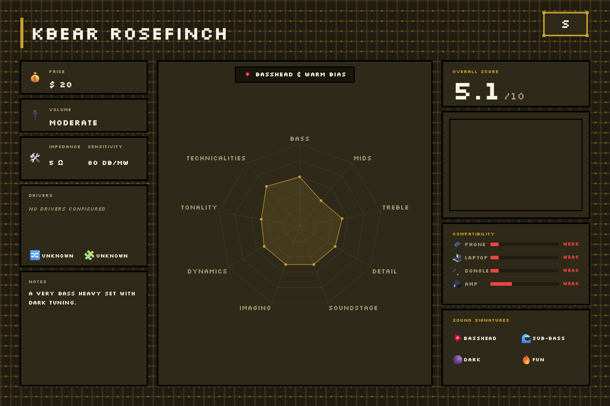 |

---

## 🛠️ Windows Helper Utilities

Standalone executables for managing database entries and measurement files:

| Utility | What It Does | How to Use |
| :--- | :--- | :--- |
| **`Database Editor.exe`** | Desktop GUI to edit, validate, and repair `database.json`. Audits missing files, auto-fixes price tiers, normalizes path slashes, and checks schema rules. | Place next to `database.json` and run. Edit entries directly or use the **Tools** menu. |
| **`Curve Converter.exe`** | Converts raw `.txt` / `.csv` measurement data (Squiglink, Crinacle, etc.) into the standardized format and averages L/R channels. | Drag and drop raw measurement files onto the `.exe`. Outputs to `/Converted`. |
| **`Split Database.exe`** | Splits large JSON databases into smaller chunks to fit AI context windows for auditing. | Drag and drop `database.json` onto the `.exe`. Outputs to `/chunks`. |
| **`Compress Database.exe`** | Compresses `database.json` into `database.json.gz` for faster in-app catalog loading. | Place next to `database.json` and run. |

## 🔄 Updating the Catalog & Measurement Curves

You do **not** need to redownload or reinstall the entire application to get newly added IEMs, headphones, and frequency response measurements. You can update your local database and curves independently in seconds:

1. Head over to the **[📦 Official Database Repository](https://github.com/MyLittlePrimordia/Database)**.
2. Click **Code** → **[Download ZIP](https://github.com/MyLittlePrimordia/Database/archive/refs/heads/main.zip)** (or `git pull` if cloned).
3. Extract the archive and copy/overwrite the following into your **IEM Tool** directory:
   * `database.json`
   * `database.json.gz`
   * `data/` *(folder containing all raw `.txt` measurement curve files)*

   **Where to place them:**
   * **Windows:** In the same folder as `IEM Tool.exe` (or inside the `resources/` folder if installed).
   * **macOS:** Right-click `IEM Tool.app` → *Show Package Contents* → `Contents/Resources/`.
   * **Linux:** In the same directory alongside the `AppImage` or executable.

4. Relaunch **IEM Tool** — all newly added gear, graph curves, and auto-EQ target profiles will load automatically.

---

## 🔗 Ecosystem & Companion Tools

| Repository | Description |
| :--- | :--- |
| **[🎧 IEM Tool](https://github.com/MyLittlePrimordia/IEM-Tool)** | The main desktop workspace for finding, tuning, testing, and reviewing IEMs. |
| **[📦 Database](https://github.com/MyLittlePrimordia/Database)** | The central upstream repository hosting `database.json`, `database.json.gz`, and raw measurement curves. |
| **[🛠️ DB Tool](https://github.com/MyLittlePrimordia/Database-Tool)** | A standalone desktop app for editing, auditing, and maintaining the catalog. |

---

## 💻 Development & Building

Built as an Electron desktop app with a local HTTP server serving a sandboxed renderer.

```bash
# Install dependencies
npm install

# Start development app
npm start

# Rebuild assets after editing
npm run build:js
npm run build:css

# Package platform builds
npm run dist-win
npm run dist-mac
npm run dist-linux

Built With

    * Core: Electron, Vanilla JavaScript (ES6+), HTML5, Tailwind CSS

    * Audio Engine: Web Audio API (AudioWorklet, Biquad Filters, HRTF Spatial Panner, Convolver)

    * Rendering & Storage: HTML5 Canvas, IndexedDB, Electron SafeStorage