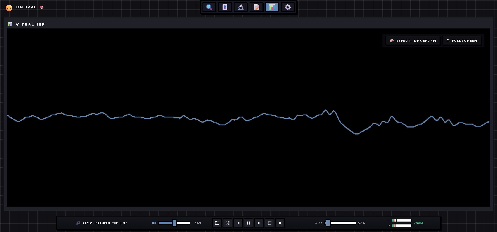
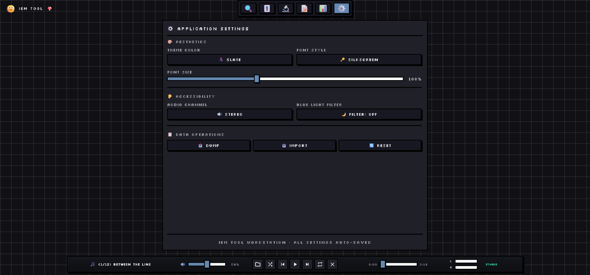

# 🎧 IEM Tool

A Complete Offline Workstation for In-Ear Monitors (IEMs)

Built for audio enthusiasts, reviewers, and tuners who want an all-in-one offline tool for reviewing, tuning, testing, comparing, and discovering IEMs.

---

## ✨ Key Features in V2

* 🔍 **Smart Recommendation Engine (Find):** Match IEMs based on custom sound preferences, target curves, or spec constraints.
* ❤️ **Taste Matcher:** Average your favorite IEMs into a custom acoustic fingerprint to find matching sound signatures.
* 🗡️ **Giant-Killer Clone Hunter:** Discover budget IEMs ($15–$200) that replicate $500+ flagship sound profiles.
* 🚀 **Upgrade Pathway Engine:** Generate step-up acoustic ladders (*Starter*, *Leap*, *Endgame*) based on your owned gear and goals.
* ✏️ **Target Sculptor & Freehand Draw:** Draw or sculpt custom target curves directly on the interactive frequency response graph.
* 🎚️ **Parametric EQ & AutoEQ Solver:** 1-Click AutoEQ solver supporting 10 to 50 band resolutions with Anti-Clip Limiter and Auto-Gain Matching.
* 🌌 **3D Soundstage & Spatial Simulator:** Interactive 3D spatial pad with HRTF positioning and room acoustic simulations.
* 🔬 **Acoustic Test Lab:** Ear Canal Resonance Peak locking, Channel Imbalance detector, Burn-In Station, and 10 Diagnostic Sweeps.
* 🎮 **Blind A/B & ABX Test Station:** Conduct blind listening tests with crossfading and statistical confidence scoring ($P$-value).
* 📝 **Review Profile Suite:** Rate IEMs with radar spider charts, sound characteristic sliders, photo attachment background removal, and DAC power/driveability calculations.
* 📊 **Real-time Audio Visualizers:** Spectrum Oscilloscope, OLED Bars, Spectrogram, 3D Waterfall, and Audio Mesh effects.
* 🎨 **Custom 8-Bit Retro Themes & Fonts:** 9 retro skins (Parchment, Slate, Ember, Circuit, Byte, Cartridge, Arcade, Blush, Bit) with auto-scaled retro fonts.
* 🚫 **100% Offline & Private:** Runs completely local in your browser without requiring server connections.

---

## 📸 Workspaces Overview

### 1. 🔍 Find (Recommendations & Clone Engine)
*The default landing workspace in V2.*
* **Tuning Search:** Adjust bass, warmth, vocals, treble, and smoothness sliders to generate custom target curves and find matching IEMs.
* **Spec Filters:** Filter database models by Price Range ($0–$3000), Release Year (1995–2026), Driver Tech (DD, BA, Planar, EST, PZT, BC, MEMS), Connectors, and Tags.
* **Taste Matcher:** Select up to 3 favorite IEMs to synthesize a custom acoustic profile.
* **Giant-Killer Hunter:** Pick a $500+ flagship IEM to find budget-friendly alternatives under your chosen price ceiling.
* **Upgrade Pathway:** Select an IEM you own to build a 3-tier upgrade ladder (*Starter*, *Leap*, *Endgame*).

  

---

### 2. 🎚️ EQ (Parametric Equalizer)
* **Interactive FR Graph:** Drag EQ nodes or trace custom targets directly on the viewport.
* **AutoEQ Engine:** Solves parametric EQ filters automatically across 10, 15, 20, 30, 40, or 50 band resolutions.
* **Presets & Acoustics:** Standard & Advanced cards, Speaker Crossfeed, Stereo Expander, Loudness Compensation, De-Esser, and Reverb simulator.
* **Preset Exporters:** Export active filters directly to **Peace**, **Wavelet**, **Poweramp**, **Qudelix**, and **FxSound**.

  

---

### 3. 🔬 Test (Acoustic Test Lab)
* **Ear Resonance Peak:** Sweep 6.4kHz–9.6kHz to locate and lock your ear canal resonance peak, applying an automatic notch filter.
* **Channel Imbalance & Swap:** Test L/R balance with real-time RMS meter readouts and 1-click L/R channel swapping.
* **Burn-In Station:** Timed white/pink/brown noise generator with customizable timers (1H, 4H, 8H, 24H, Infinite) and rest cycles.
* **3D Soundstage Pad:** Move test audio sources freely across a 3D acoustic grid.
* **Blind A/B & ABX Test:** Compare two tracks side-by-side with synchronized playback and statistical confidence tracking.
* **Hearing Test & Isolation:** Generate corrective EQ profiles based on your frequency threshold limits.

  

---

### 4. 📝 Review (IEM Evaluation Suite)
* **Specs & Drivers:** Configure driver layouts (DD, BA, Planar, EST, PZT, BC, MEMS), crossovers, and way counts.
* **Driveability & DAC Power:** Calculate voltage/power draw ($V_{rms}$ / $mW$) and damping factor compatibility for Phone, Laptop, Dongle, and Desktop setups.
* **Radar Chart:** View 9-axis sound breakdown (Bass, Mids, Treble, Detail, Soundstage, Imaging, Dynamics, Tonality, Technicalities).
* **Photo Attachment:** Upload photos with built-in background removal and zoom/pan controls.
* **Inventory Library:** Save, search, export, and compare up to 4 IEM review profiles side-by-side.

  

---

### 5. 📊 Visualizer (Real-time Spectrum)
* Immersive spectrum visualizer with 6 switchable render modes: **Waveform Oscilloscope**, **OLED Spectrum Bars**, **Horizontal Spectrogram**, **3D Waterfall**, **Acoustic Tunnel**, and **3D Audio Mesh**.

  

---

### 6. ⚙️ Settings
* App customization, theme selector, font styling, reading size scaling, blue-light night shift filter, data dumping, and workspace resets.

  

---

## 🎨 8-Bit Retro Themes

Customize your workstation interface with 9 built-in skins:

| Theme | Name | Preview |
| :--- | :--- | :---: |
| `parchment` | **Parchment** *(Default)* |  |
| `slate` | **Slate** |  |
| `ember` | **Ember** |  |
| `circuit` | **Circuit** |  |
| `byte` | **Byte** |  |
| `cartridge` | **Cartridge** |  |
| `arcade` | **Arcade** |  |
| `blush` | **Blush** |  |
| `bit` | **Bit** |  |

---

## 📂 Utilities & Executables

### 1. 🔍 Database Audit (`Database Audit.exe`)

#### ❓ What does this tool do?
The application relies on `database.json` to index available measurement curves in your library. When new measurement files are added, removed, or renamed in the `data` folder, `database.json` must reflect those changes.

This utility scans for missing or unlinked measurement files and generates a clean text summary (`audit_report.txt`).

#### 🚀 How to use it:
1. Place **`Database Audit.exe`** in the same folder as your `data` directory and **`database.json`**.
2. Run **`Database Audit.exe`**.
3. It will scan your directory and write a report detailing:
   * **Missing Files:** Listed in `database.json` but missing from the `data/` folder.
   * **Unlinked Files:** Existing in the `data/` folder but missing from `database.json`.
   * **Duplicate IDs & Path References.**

---

### 2. 🎛️ Curve Converter (`Curve Converter.exe`)

#### ❓ What does this tool do?
Measurement data from sources like Squiglink, Crinacle, and other databases come in different formats, delimiters, and naming styles.

This utility converts raw measurement files into a standardized format ready for **IEM Tool**.

#### 🌟 Key Features:
* **📁 Universal Reader:** Converts raw `.txt` and `.csv` measurement files.
* **⚖️ L/R Channel Averaging:** Detects Left and Right files (e.g., `L`/`R`, `[1]`/`[2]`) and averages them into a single curve.
* **✍️ Clean Formatting:** Standardizes frequency points and column delimiters.
* **📂 Converted Folder Output:** Places output files directly into a clean `Converted/` directory.

#### 🚀 How to use it:
1. Drag & drop `.txt` or `.csv` files onto **`Curve Converter.exe`** (or place them in the same folder and run it).
2. Converted files will be generated in the **`Converted/`** folder ready to import into IEM Tool.

---

### 3. 📦 Split Database (`Split Database.exe`)

#### ❓ What does this tool do?
Large JSON databases can exceed AI model upload limits or context windows, making it difficult to audit and verify entries.

This utility splits a large `database.json` file into smaller AI-friendly JSON chunks while preserving the original database structure and entries.

#### 🌟 Key Features:
* **🧩 Smart JSON Splitting:** Automatically divides large databases into smaller chunk files.
* **🤖 AI-Friendly Chunks:** Creates chunks sized for AI auditing workflows (Gemini, Claude, GPT, etc.).
* **📂 Drag & Drop Support:** Drop any `.json` database file directly onto the executable.
* **📁 Automatic Output:** Creates a `chunks/` folder and generates numbered chunk files.
* **🔒 Data Preservation:** Keeps all original JSON entries intact without modifying the data.

#### 🚀 How to use it:
1. Place **`Split Database.exe`** anywhere convenient.
2. Drag and drop a `.json` database file onto **`Split Database.exe`**.
3. The tool will automatically create a `chunks/` folder.
4. The database will be split into smaller files:

---

### 4. 🗜️ Compress Database (`Compress Database.exe`)

#### ❓ What does this tool do?
IEM Tool loads the measurement catalog from `database.json` (or the smaller `database.json.gz` when available). Large catalogs can take longer to download and parse.
This utility compresses `database.json` into a GZip archive (`database.json.gz`) so the app can load the catalog faster and with less bandwidth, without changing any of the data inside.

#### 🌟 Key Features:
* **📦 GZip Compression:** Creates a standard `database.json.gz` file from `database.json`.
* **🔒 Lossless:** Does not modify or remove any catalog entries — only compresses the file.
* **📂 Same-folder workflow:** Reads and writes next to the executable for a simple drop-in setup.
* **📉 Smaller footprint:** Often reduces catalog size significantly for quicker loading.

#### 🚀 How to use it:
1. Place **`Compress Database.exe`** in the same folder as your **`database.json`**.
2. Run **`Compress Database.exe`**.
3. It will generate **`database.json.gz`** in that same folder.
4. Keep both files (or prefer the `.gz` in your app setup) — IEM Tool can load the compressed catalog when present.

---

## 🛠️ Built With

* **HTML5 / Vanilla JavaScript (ES6+)**
* **Tailwind CSS (Static 8-Bit Build)**
* **Web Audio API** (Custom DSP Worklet Node, Biquad Filters, HRTF Spatial Panner, Stereo Panner, Convolver, Dynamics Compressor, Analyser Node)
* **HTML5 Canvas API** (Frequency Response Graphs, Visualizers, Card Exporters)
* **IndexedDB & SafeStorage** (Offline Database Storage & Cache)