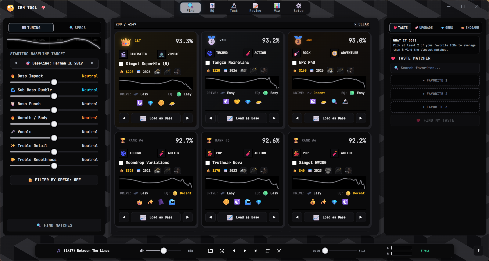
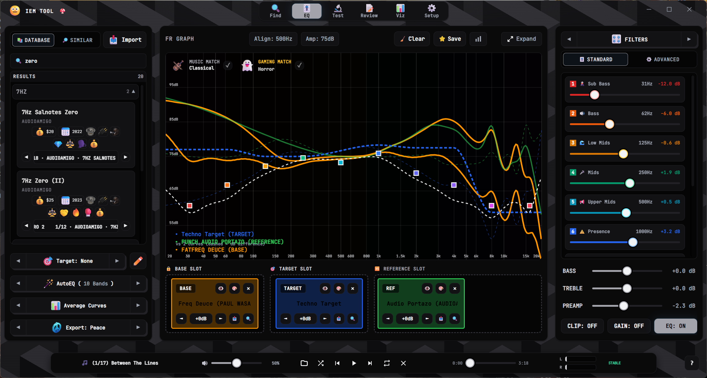
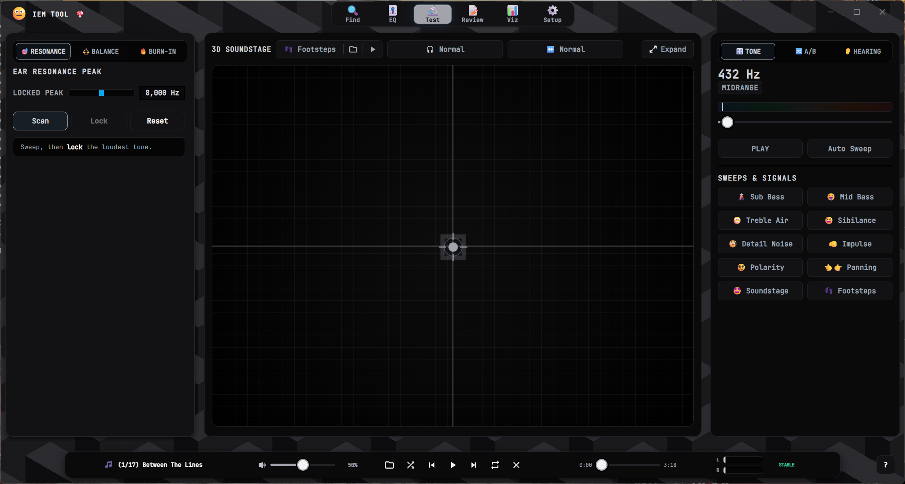
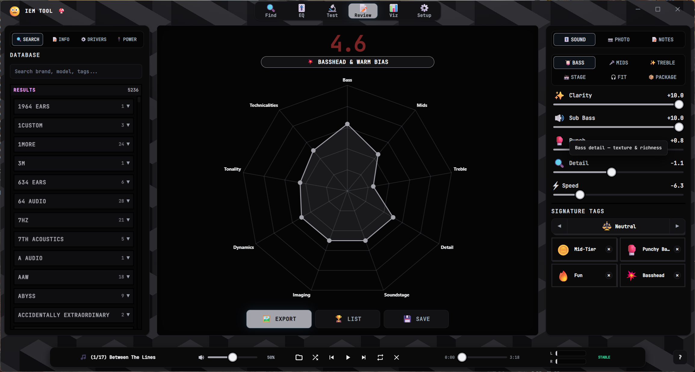
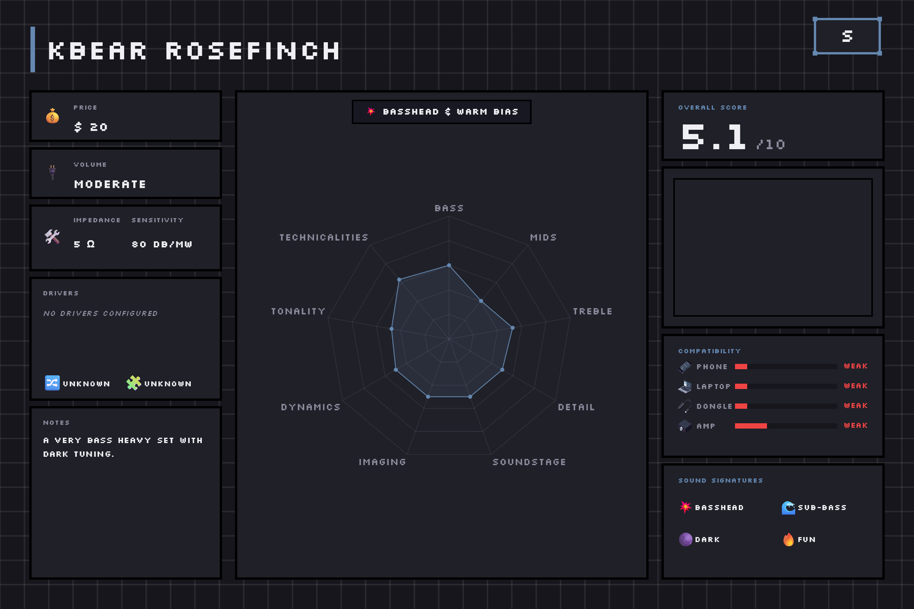
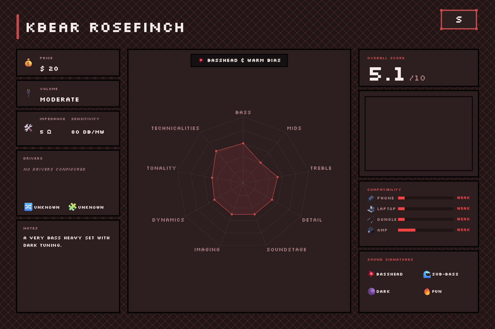
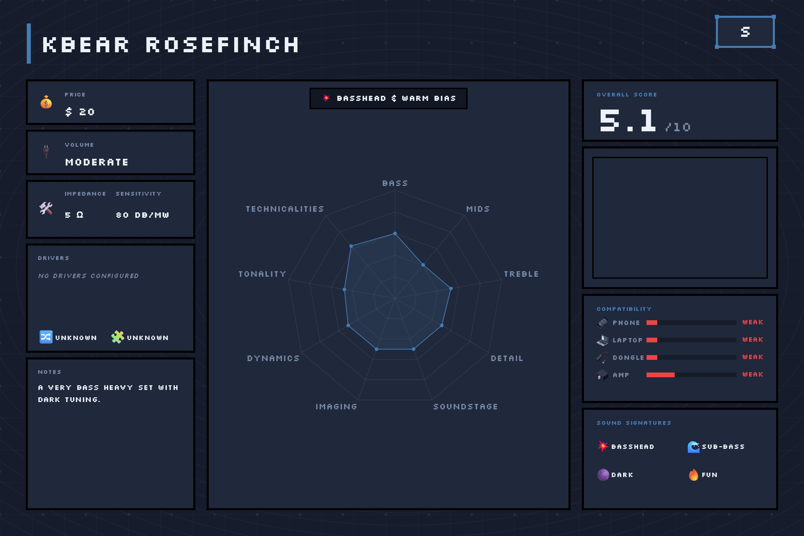
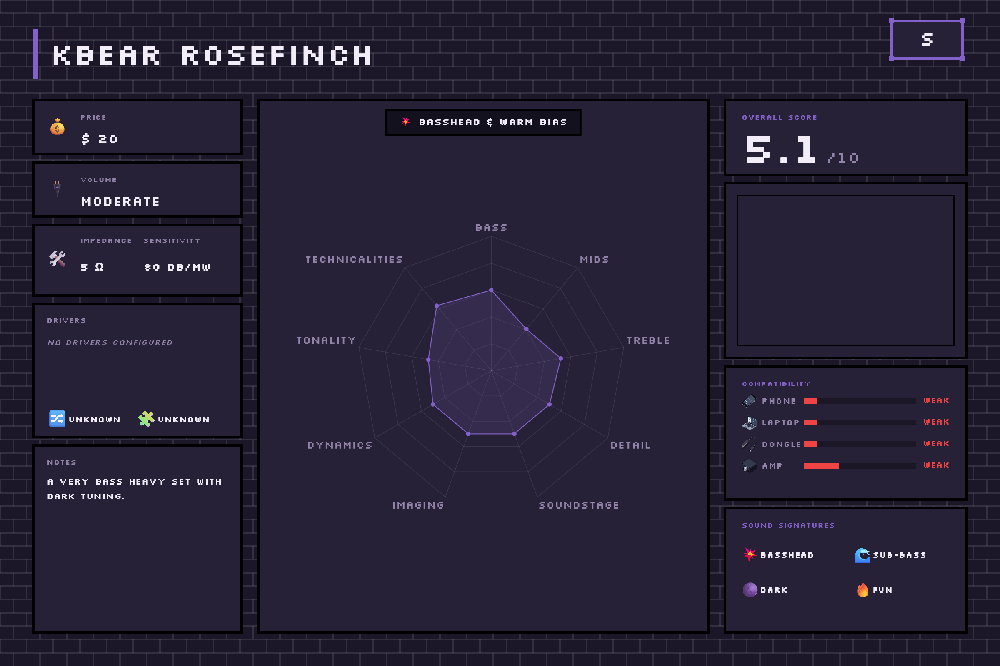
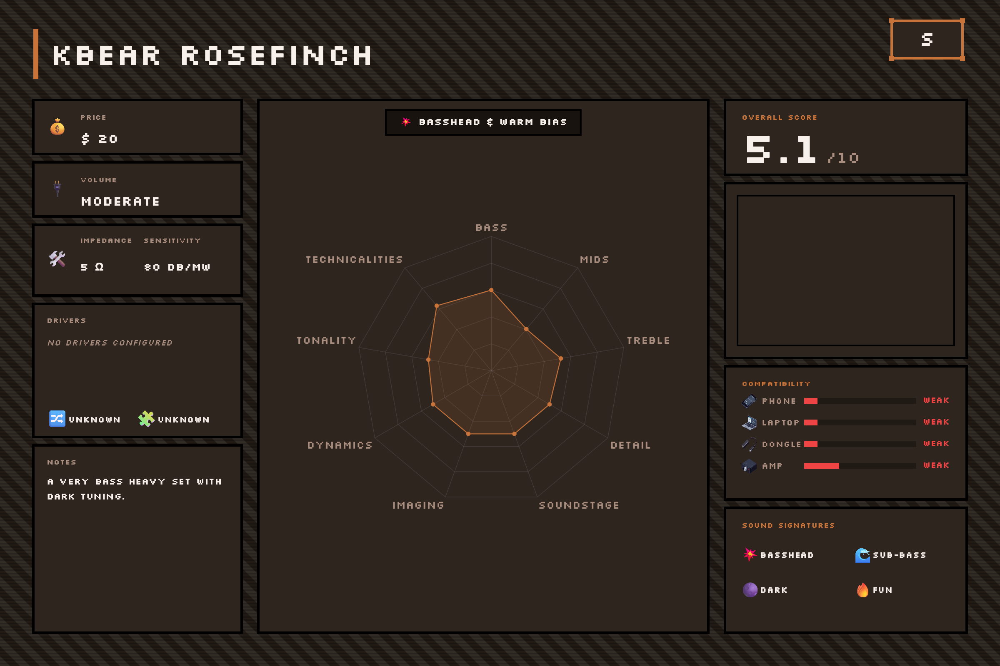
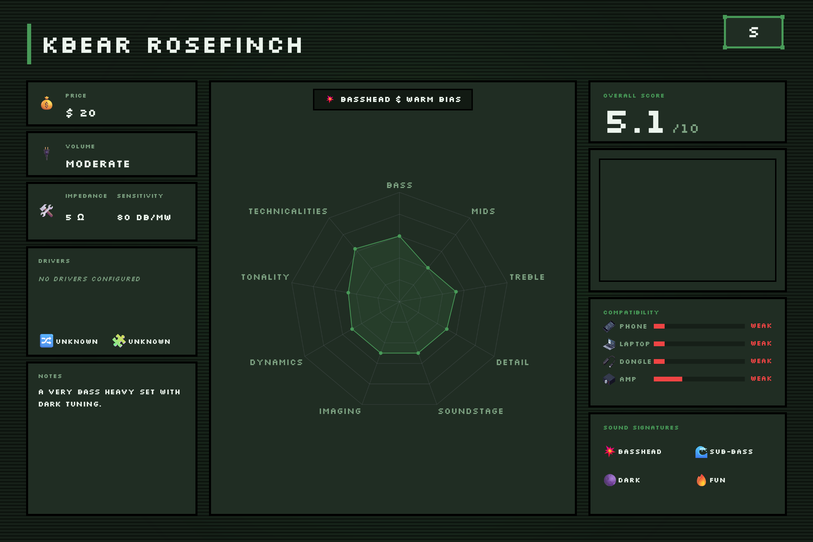

# 🎧 IEM Tool

**The offline audio playground for exploring, tuning, and testing In-Ear Monitors.**

Find budget clones of $1,000 flagships, tune any set with 1-click AutoEQ, pinpoint harsh treble peaks, and test your gear—100% offline with zero signups or tracking.

[📥 **Download Latest Release (Windows / macOS / Linux)**](https://github.com/MyLittlePrimordia/IEM-Tool/releases/latest)  
*100% Free • Portable • Works completely offline*

---

## ✨ What You Can Do

- 💎 **Find Budget "Gems" & Clones:** Match frequency curves to find cheap budget alternatives that sound just like flagship $1,000+ IEMs.
- 🎛️ **1-Click AutoEQ:** Instantly tune your IEMs to match target sound signatures or music genres. Export presets straight to **Wavelet**, **Peace EQ**, **Qudelix**, **Poweramp**, and **FxSound**.
- 🔬 **Acoustic Ear Lab:** Sweep audio frequencies to find your unique ear canal resonance peak, balance uneven left/right channels, and blind test audio tracks.
- ⚡ **Power & Dongle Calculator:** Find out if your phone, dongle, or desktop DAC/amp has enough power to drive your IEMs.
- 🎨 **Retro Themes & Visualizers:** 6 live audio visualizers and 9 retro skins with matching pixel fonts.

---

## 📸 Workspaces

### 1. 🔍 Find (Recommendations & Clones)
Filter by price, driver type, or sound signature. Pick an expensive dream set to instantly find budget twins with matching frequency curves.

<p align="center">
  
</p>

---

### 2. 🎚️ EQ (Parametric Equalizer)
Draw your own curves or let the AutoEQ engine solve them for you. Includes crossfeed, de-essing, stereo widening, and 1-click exports.

<p align="center">
  
</p>

---

### 3. 🔬 Test (Acoustic Lab)
Find personal ear canal resonance peaks, check channel balance, and run blind A/B audio tests to see if you can really tell the difference.

<p align="center">
  
</p>

---

### 4. 📝 Review & Power Calculator
Calculate exact voltage and mW requirements for your gear, take notes, and compare IEMs side-by-side with radar charts.

<p align="center">
  
</p>

---

## 🎨 Themes

Switch between 9 retro styles anytime from the settings:

| Slate (Default) | Ember | Circuit |
| :---: | :---: | :---: |
|  |  |  |
| **Arcade** | **Cartridge** | **Byte** |
|  |  |  |

*(Also includes Parchment, Blush, and Bit)*

---

## 🔄 Updating IEM Data (Without Reinstalling)

You don't need to reinstall the app to get newly measured IEMs:

1. Download the latest data from the **[📦 Database Repo](https://github.com/MyLittlePrimordia/Database/archive/refs/heads/main.zip)**.
2. Extract and drop `database.json` and the `data/` folder into your app directory:
   - **Windows:** Drop into the same folder as `IEM Tool.exe`.
   - **macOS:** Right-click `IEM Tool.app` → *Show Package Contents* → `Contents/Resources/`.
   - **Linux:** Drop in the same directory as the `AppImage`.
3. Restart **IEM Tool** to see the new gear and curves.

---

<details>
<summary><b>🔗 Companion Tools & Ecosystem</b></summary>

| Repository | Description |
| :--- | :--- |
| **[🎧 IEM Tool](https://github.com/MyLittlePrimordia/IEM-Tool)** | The main desktop workspace for finding, tuning, testing, and reviewing IEMs. |
| **[🛠️ DB Tool](https://github.com/MyLittlePrimordia/Database-Tool)** | Desktop app for editing and maintaining the IEM measurement catalog. |
| **[📦 Database](https://github.com/MyLittlePrimordia/Database)** | The raw repository hosting measurement curve files and datasets. |
</details>

<details>
<summary><b>💻 Development & Building</b></summary>

```bash
# Install dependencies
npm install

# Start development app
npm start

# Package desktop builds
npm run dist-win
npm run dist-mac
npm run dist-linux
```
</details>