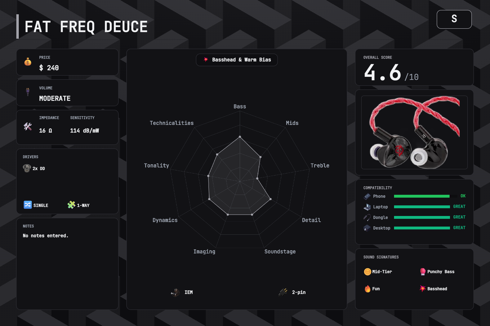
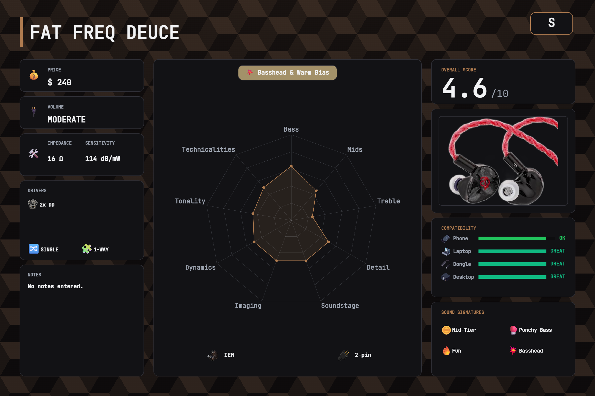
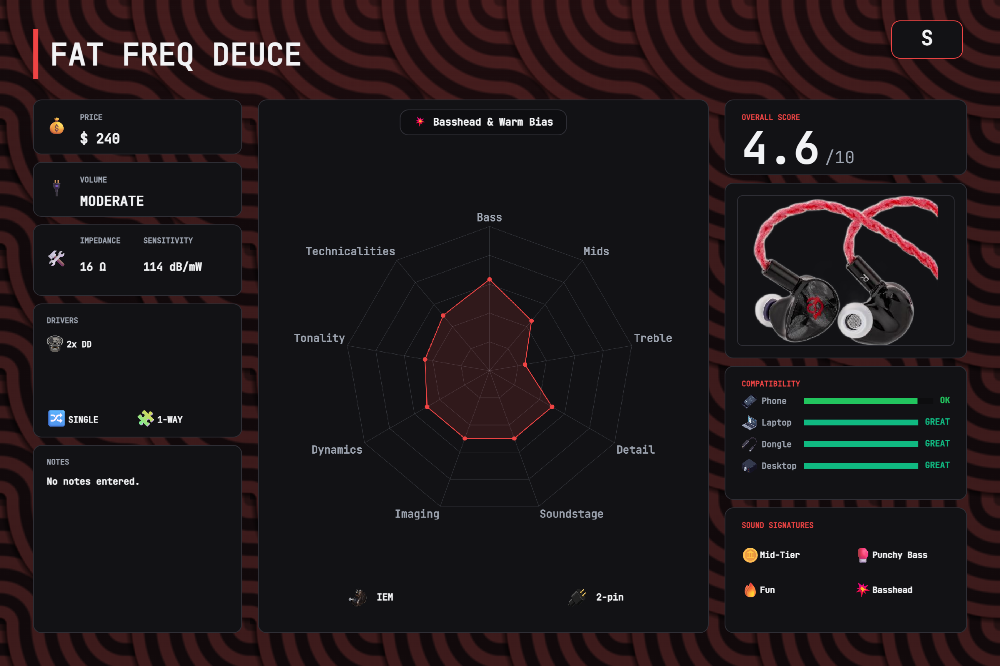
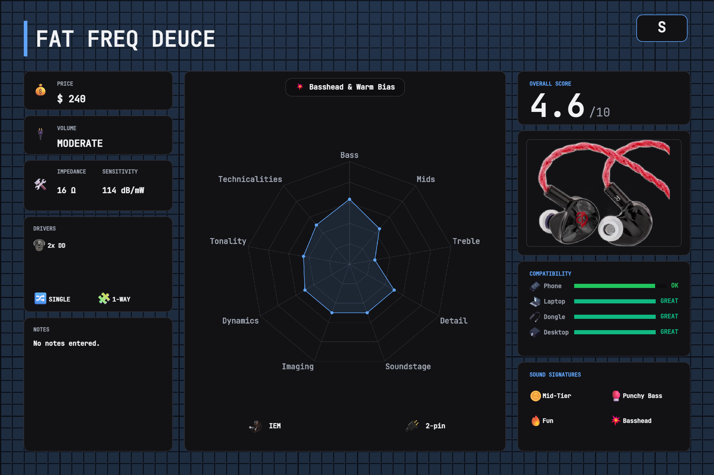
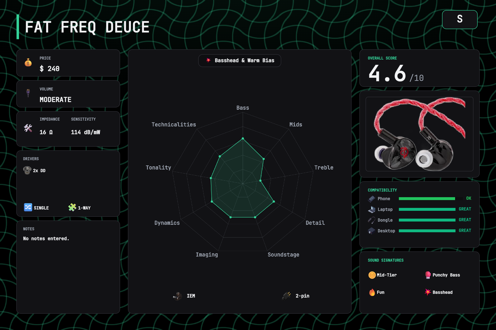
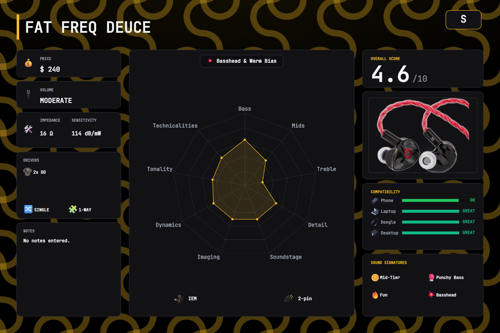
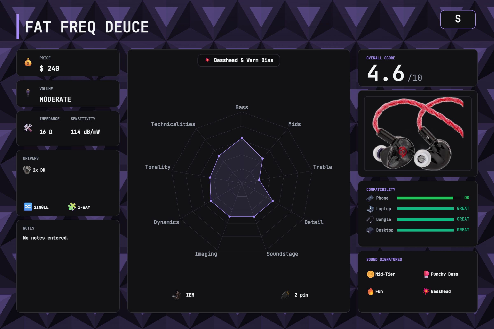
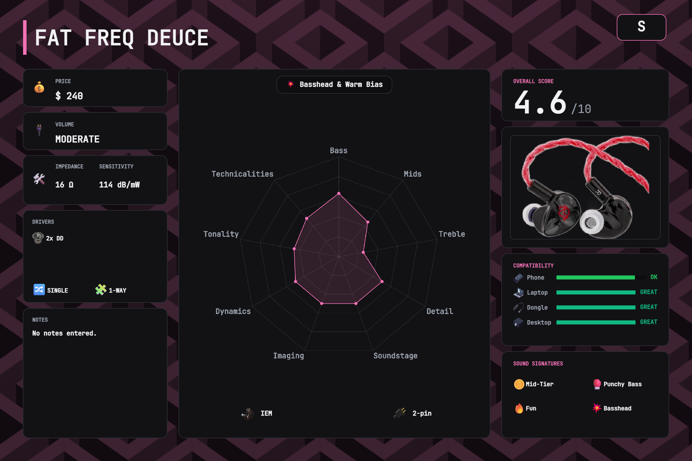
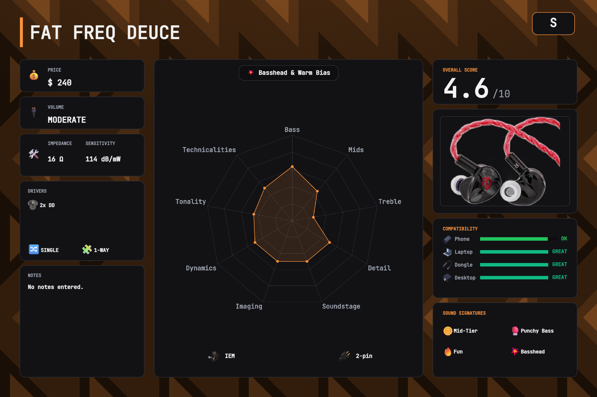

# 🎧 IEM Tool

**The offline audio playground for exploring, tuning, and testing In-Ear Monitors.**

Find budget clones of $1,000 flagships, tune any set with 1-click AutoEQ, pinpoint harsh treble peaks, and test your gear—100% offline with zero signups or tracking.

[📥 **Download Latest Release (Windows / macOS / Linux)**](https://github.com/MyLittlePrimordia/IEM-Tool/releases/latest)  
*100% Free • Works completely offline*

---

## ✨ What You Can Do

- 💎 **Find Budget "Gems" & Clones:** Match frequency curves to find cheap budget alternatives that sound just like flagship $1,000+ IEMs.
- 🎛️ **1-Click AutoEQ:** Instantly tune your IEMs to match target sound signatures or music genres. Export presets straight to **Wavelet**, **Peace EQ**, **Qudelix**, **Poweramp**, and **FxSound**.
- 🔬 **Acoustic Ear Lab:** Sweep audio frequencies to find your unique ear canal resonance peak, balance uneven left/right channels, and blind test audio tracks.
- ⚡ **Power & Dongle Calculator:** Find out if your phone, dongle, or desktop DAC/amp has enough power to drive your IEMs.
- 🎨 **Colour Themes & Visualizers:** 6 live audio visualizers and 9 colour themes, each with its own backdrop pattern.

---

## 📸 Workspaces

### 1. 🔍 Find (Recommendations & Clones)
Filter by price, driver type, or sound signature. Pick an expensive dream set to instantly find budget twins with matching frequency curves.

<p align="center">
  
</p>

---

### 2. 🎚️ EQ (Parametric Equalizer)
Draw your own curves or let the AutoEQ engine solve them for you. Includes crossfeed, de-essing, stereo widening, and 1-click exports.

<p align="center">
  
</p>

---

### 3. 🔬 Test (Acoustic Lab)
Find personal ear canal resonance peaks, check channel balance, and run blind A/B audio tests to see if you can really tell the difference.

<p align="center">
  
</p>

---

### 4. 📝 Review & Power Calculator
Calculate exact voltage and mW requirements for your gear, take notes, and compare IEMs side-by-side with radar charts.

<p align="center">
  
</p>

---

## 🎨 Themes

Switch between 9 colour themes anytime from the settings. Each one has its own accent colour *and* its own backdrop pattern:

| ⚫ Black | 🟤 Brown | 🔴 Red |
| :---: | :---: | :---: |
|  |  |  |
| **🔵 Blue** | **🟢 Green** | **🟡 Yellow** |
|  |  |  |
| **🟣 Purple** | **🌸 Pink** | **🟠 Orange** |
|  |  |  |

---

## 🚀 Installing & Running

| Platform | File | How |
| :--- | :--- | :--- |
| **Windows** | `IEM-Tool-Setup.exe` | Run the installer and follow the wizard. Launch from the Start menu or desktop shortcut. |
| **Linux** | `IEM-Tool.appimage` | `chmod +x IEM-Tool.appimage`, then run it. Portable, no install. (Needs FUSE 2; if it won't start, run it with `--appimage-extract-and-run`.) |
| **macOS** | `IEM-Tool.dmg` | Open the DMG and drag the app to Applications. |

Your settings, themes and saved reviews are stored per user (Windows: `%APPDATA%\iem-tool`). The Linux AppImage instead keeps `IEM-Profile/` and `IEM-Data/` next to the file, so it can run from a USB stick.

---

## 🔄 Updating IEM Data (Without Reinstalling)

You don't need a new app version to get newly measured IEMs:

1. Download the latest data from the **[📦 Database Repo](https://github.com/MyLittlePrimordia/Database/archive/refs/heads/main.zip)**.
2. In IEM Tool open **Settings → Data → Offline database → Open folder**. This opens the `IEM-Data` folder (it is created for you).
3. Extract the download and drop `database.json` (and `database.json.gz` if included) plus the `data/` folder into that `IEM-Data` folder. (Linux AppImage: it sits next to the AppImage. macOS: `~/Library/Application Support/IEM Tool/IEM-Data/`.)
4. Restart **IEM Tool**.

Files in `IEM-Data` win over the database built into the app, and anything missing there is still read from the built-in copy. To go back to the built-in database, delete the `IEM-Data` folder.

---

<details>
<summary><b>🔗 Companion Tools & Ecosystem</b></summary>

| Repository | Description |
| :--- | :--- |
| **[🎧 IEM Tool](https://github.com/MyLittlePrimordia/IEM-Tool)** | The main desktop workspace for finding, tuning, testing, and reviewing IEMs. |
| **[🛠️ DB Tool](https://github.com/MyLittlePrimordia/Database-Tool)** | Desktop app for editing and maintaining the IEM measurement catalog. |
| **[📦 Database](https://github.com/MyLittlePrimordia/Database)** | The raw repository hosting measurement curve files and datasets. |
</details>

<details>
<summary><b>💻 Development & Building</b></summary>

```bash
# Install dependencies
npm install

# Start development app
npm start

# Package desktop builds
npm run dist-win
npm run dist-mac
npm run dist-linux
```
</details>

## Impedance data for the Gear Simulator (optional)

The 10-100 ohm adapter options model the voltage divider formed by the adapter and the
IEM's impedance curve. Drop a measured curve for an IEM at

    data/impedance/<database entry id>.txt

(the `id` field in `database.json`, e.g. `earfun_wave_pro.txt`). One point per line,
`frequency_Hz  impedance_ohms`, separated by spaces, tabs, commas or semicolons; lines
starting with `#` and text headers are ignored. The curve must cover roughly 100 Hz to
10 kHz with at least 8 points. With a valid file the adapter is fitted to that IEM and its
label reads "(measured Z)"; without one the generic approximation is used. Use
Settings > Offline database > Refresh after adding files.
