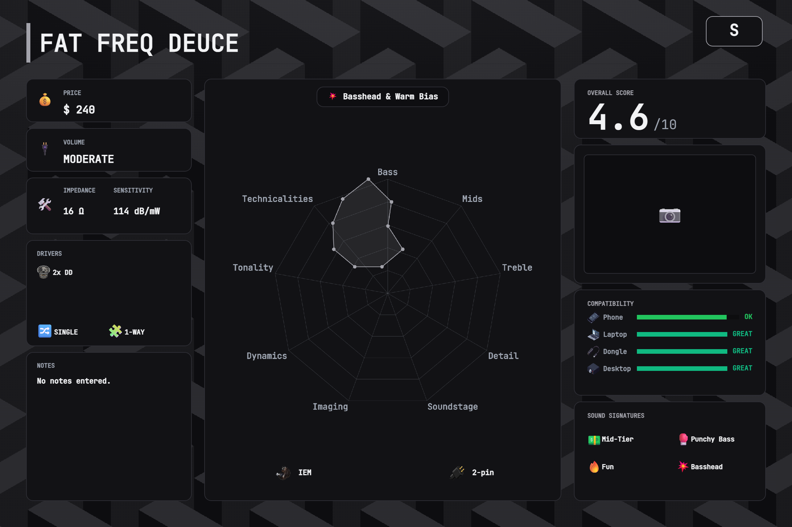
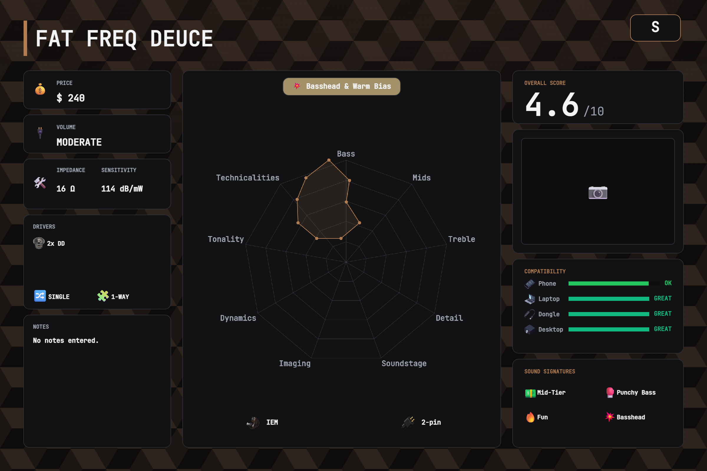
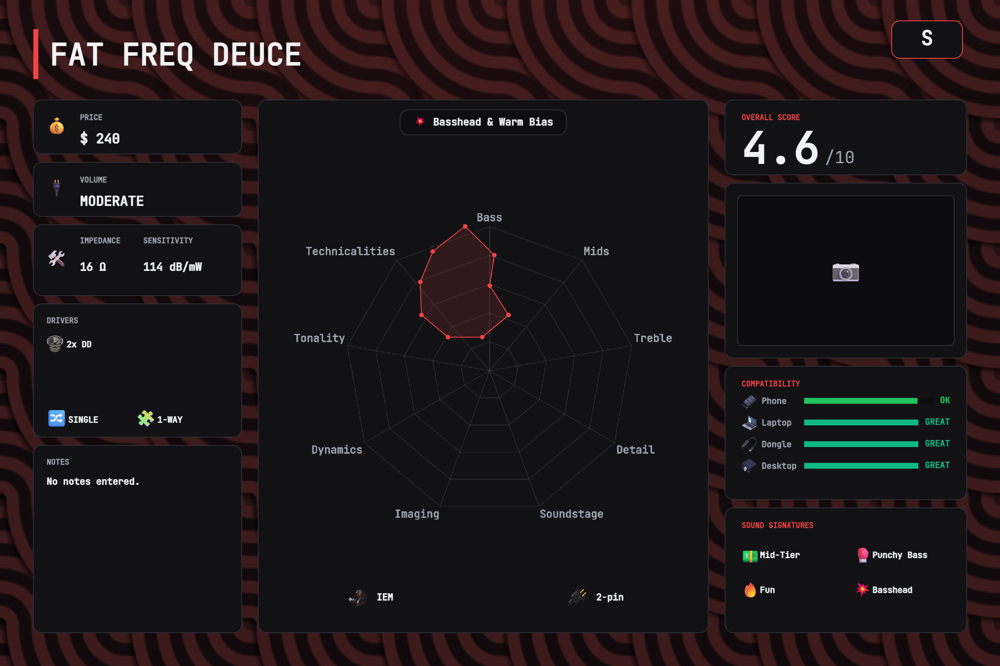
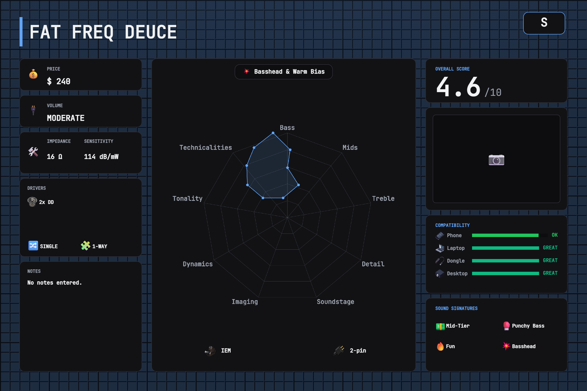
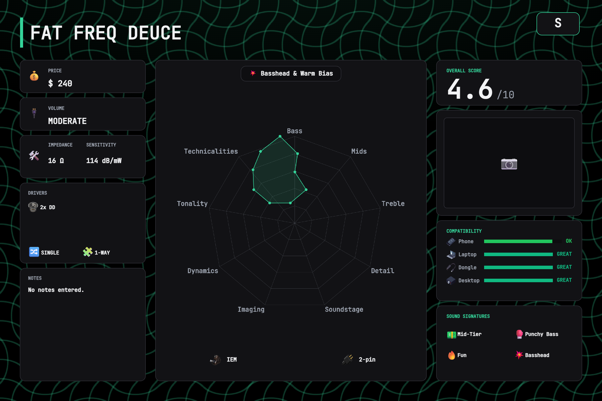
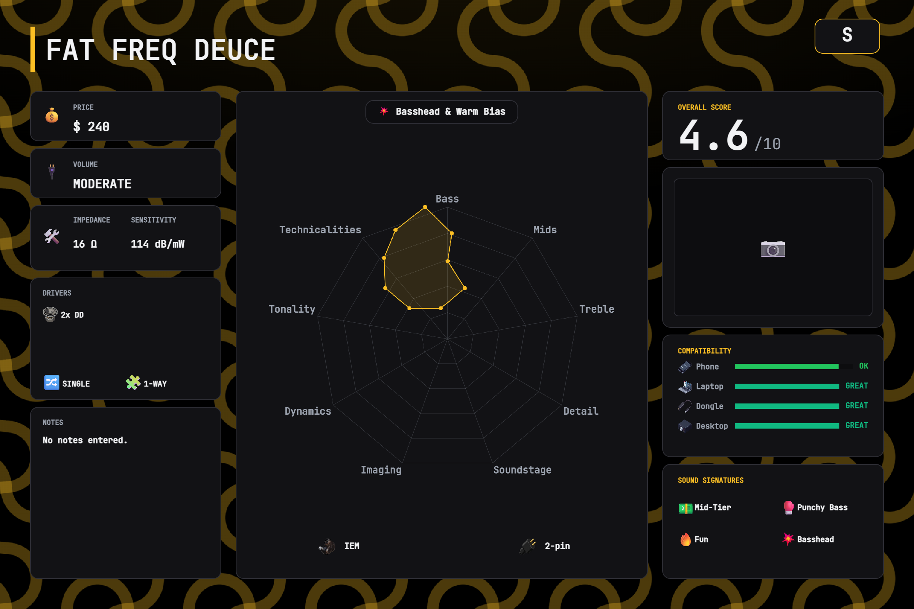
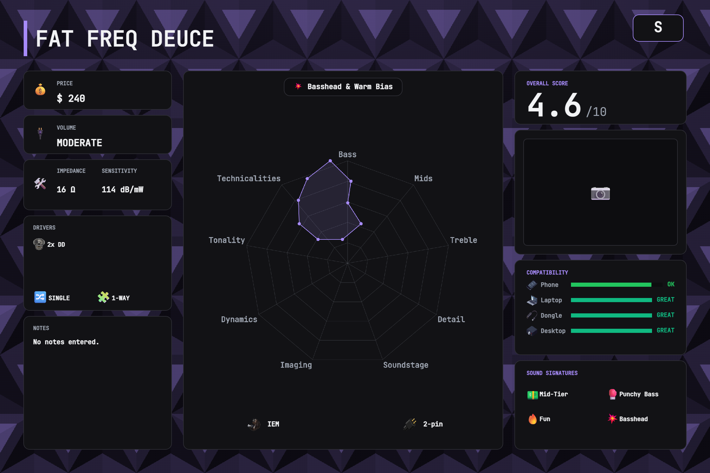
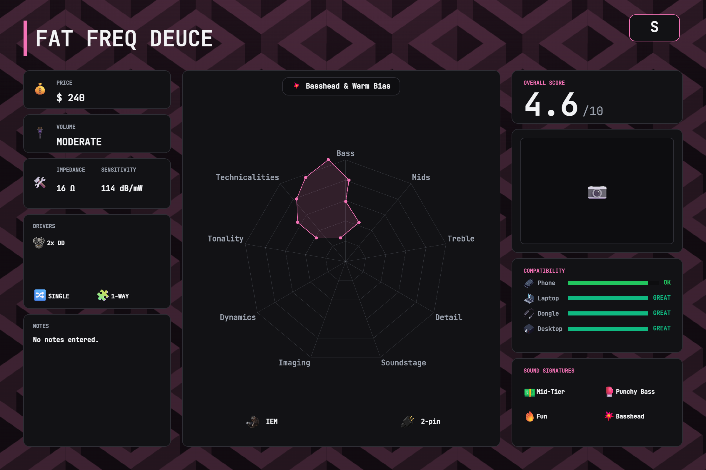
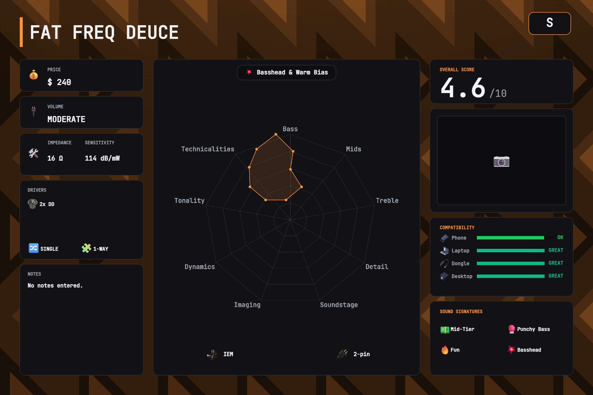

# 🎧 IEM Tool

**The offline audio playground for exploring, tuning, and testing In-Ear Monitors.**

Find budget clones of $1,000 flagships, tune any set with 1-click AutoEQ, and test your gear—100% offline with zero signups or tracking.

[📥 **Download Latest Release (Windows / macOS / Linux)**](https://github.com/MyLittlePrimordia/IEM-Tool/releases/latest)  
*100% Free • Works completely offline*

---

## ✨ What You Can Do

- 💎 **Find Budget "Gems":** Match frequency curves to find cheap alternatives that sound like flagship $1,000+ IEMs.
- 🎛️ **1-Click AutoEQ:** Instantly tune your IEMs and export presets to **Wavelet**, **Peace EQ**, **Qudelix**, and more.
- 🔬 **Acoustic Ear Lab:** Sweep audio frequencies, check channel balance, and run blind audio tests.
- ⚡ **Power Calculator:** Check if your phone or DAC/amp has enough juice to drive your gear.
- 🎨 **Visualizers & Themes:** Enjoy live audio visualizers and 9 unique colour themes.

---

## 🗺️ Workspaces (All 7 Tabs)

<details>
<summary><b>Click to expand and view all 7 workspaces & screenshots</b></summary>

| Workspace | Description | Preview |
| :--- | :--- | :--- |
| **1. 🔍 Find** | Filter by price, driver type, or sound signature to discover budget twins. | [📸 View Screenshot](screenshots/FIND.png) |
| **2. 🎚️ EQ** | Draw custom curves, solve AutoEQ targets, and export presets instantly. | [📸 View Screenshot](screenshots/EQ.png) |
| **3. 🔬 Test** | Pinpoint ear canal resonance peaks, check channel balance, and run blind tests. | [📸 View Screenshot](screenshots/TEST.png) |
| **4. 📝 Review** | Calculate power needs, view radar charts, and compare specs side-by-side. | [📸 View Screenshot](screenshots/REVIEW.png) |
| **5. 🗃️ Data** | Built-in editor to safely manage and update your offline database locally. | [📸 View Screenshot](screenshots/DATA.png) |
| **6. 📊 Viz** | Immersive, fullscreen live audio visualizers reacting to your music. | [📸 View Screenshot](screenshots/VIZ.png) |
| **7. ⚙️ Setup** | Customize 9 color themes, typography scaling, audio routing, and backups. | [📸 View Screenshot](screenshots/SETUP.png) |

</details>

---

## 🎨 Themes

Switch between 9 colour themes anytime from settings. Each theme features its own accent color and backdrop pattern:

| ⚫ Black | 🟤 Brown | 🔴 Red |
| :---: | :---: | :---: |
|  |  |  |
| **🔵 Blue** | **🟢 Green** | **🟡 Yellow** |
|  |  |  |
| **🟣 Purple** | **🌸 Pink** | **🟠 Orange** |
|  |  |  |

---

## 🚀 Installing & Running

| Platform | File | How |
| :--- | :--- | :--- |
| **Windows** | `IEM-Tool-Setup.exe` | Run the installer and launch from the Start menu or desktop shortcut. |
| **Linux** | `IEM-Tool.appimage` | `chmod +x IEM-Tool.appimage`, then run it. Portable, no install required. |
| **macOS** | `IEM-Tool.dmg` | Open the DMG and drag the app to Applications. |

*Saved settings and reviews are stored locally per user (Windows: `%APPDATA%\iem-tool`).*

---

## 🔄 Updating IEM Data

Get newly measured IEMs without reinstalling the app:
1. Download the latest data bundle from the **[📦 Database Repo](https://github.com/MyLittlePrimordia/Database/archive/refs/heads/main.zip)**.
2. In IEM Tool, go to **Settings → Data → Offline database → Open folder**.
3. Extract the download and drop `database.json` and the `data/` folder into that folder.
4. Restart **IEM Tool**.

---

<details>
<summary><b>🔗 Companion Tools & Ecosystem</b></summary>

| Repository | Description |
| :--- | :--- |
| **[🎧 IEM Tool](https://github.com/MyLittlePrimordia/IEM-Tool)** | The main desktop workspace for exploring, tuning, and testing IEMs. |
| **[📦 Database](https://github.com/MyLittlePrimordia/Database)** | The raw repository hosting measurement curve files and datasets. |
</details>

<details>
<summary><b>💻 Development & Building</b></summary>

```bash
# Install dependencies
npm install

# Start development app
npm start

# Package desktop builds
npm run dist-win
npm run dist-mac
npm run dist-linux